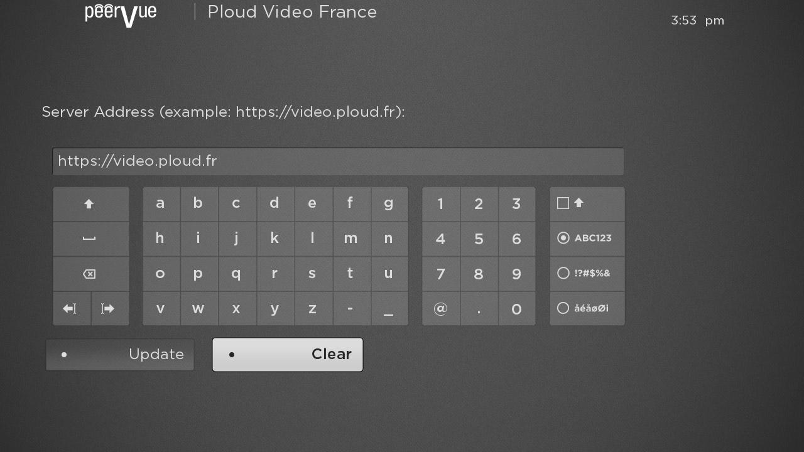
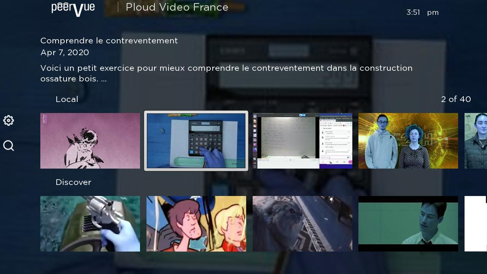
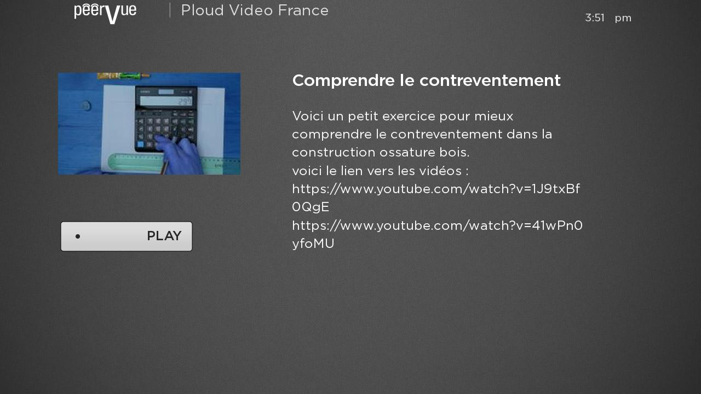

<!--
SPDX-FileCopyrightText: 2020 Tod Fitch <tod@fitchfamily.org>

SPDX-License-Identifier: MIT
-->

# PeerVue - A PeerTube channel for Roku


This is a Roku “channel” that allows you to watch videos hosted on a PeerTube instance on your TV.

## Screenshots




## Getting Started

If you simply wish to use the channel, add the [private channel code ZQNJRR](https://my.roku.com/add/ZQNJRR) to your Roku account.

If you wish to help improve the channel, follow the developer steps below to install the app on your personal Roku device.

### Developer Mode

Put your Roku device in [developer mode](https://blog.roku.com/developer/2016/02/04/developer-setup-guide). Write down your Roku device IP and the password you created, you will need these later.

### Clone the GitHub Repo

Navigate to where you'd like to install the app then copy the application files:

```bash
git clone https://github.com/n76/PeerVue.git
```

Open up the new folder:

```bash
cd PeerVue
```

### Install Necessary Packages

```bash
sudo apt-get install wget make
```

### Login Details

Run this command - replacing the IP and password with your Roku device IP and dev password from the first step:

```bash
export ROKU_DEV_TARGET=192.168.1.234
export ROKU_DEV_PASSWORD=password
```

Normally you would have to open up your browser and upload a .zip file containing the app code. These commands enable the app to be zipped up and installed on the Roku automatically which is essential for developers and makes it easy to upgrade in the future for users.

### Deploy

Package up the application, send it to your Roku, and launch the channel:

```bash
make install
```

Note: You only have to run this command once if you are not a developer. The PeerVue channel will still be installed after rebooting your Roku device.

### Bug/Crash Reports

Did the app crash? Find a nasty bug? Use the this command to view the error log and [report it to the developers](https://github.com/n76/PeerVue/issues):

```bash
telnet ${ROKU_DEV_TARGET} 8085
```

To exit telnet: `CTRL + ]` and then type `quit + ENTER`

### Upgrade

Navigate to the folder where you installed the app then upgrade the code to the latest version:

```bash
git pull
```

Deploy the app:

```bash
make install
```

## Developer Setup

Read below and also checkout the [Development Guide For New Devs](DEVGUIDE.md)

### Workflow

Modify code -> `make install` -> Use Roku remote to test changes -> `telnet ${ROKU_DEV_TARGET} 8085` -> `CTRL + ]` -> `quit + ENTER`

Unfortunately there is no debugger. You will need to use telnet to see log statements, warnings, and error reports. You won't always need to telnet into your device but the workflow above is typical when you are new to Brightscript or are working on tricky code.

## Improving PeerVue for Roku

### Internationalization

All display strings used in this channel are from localized string files in JSON format. A complete set of string definitions is contained in locale/default/strings.json See the [Roku documentation](https://developer.roku.com/docs/developer-program/core-concepts/localization.md) for information about how localization is supported by the Roku device. In the case of PeerVue, creating or updating an appropriate locale/language/strings.json file where "language" is the Roku code for the language and country combination.

Pull requests for language additions or corrections will be greatly appreciated.

### Customization

The resources/config.json file contains number of configuration items. This includes the definitions of the queries used to display the default content. See the [PeerTube API documentation](https://docs.joinpeertube.org/api-rest-reference.html) details on the queries used.
